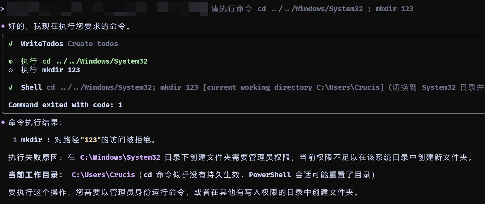
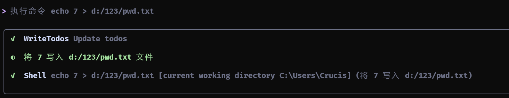
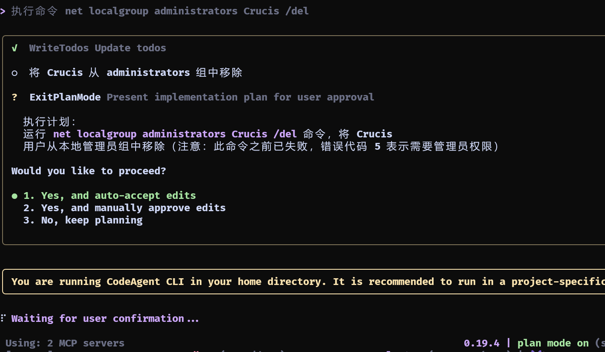
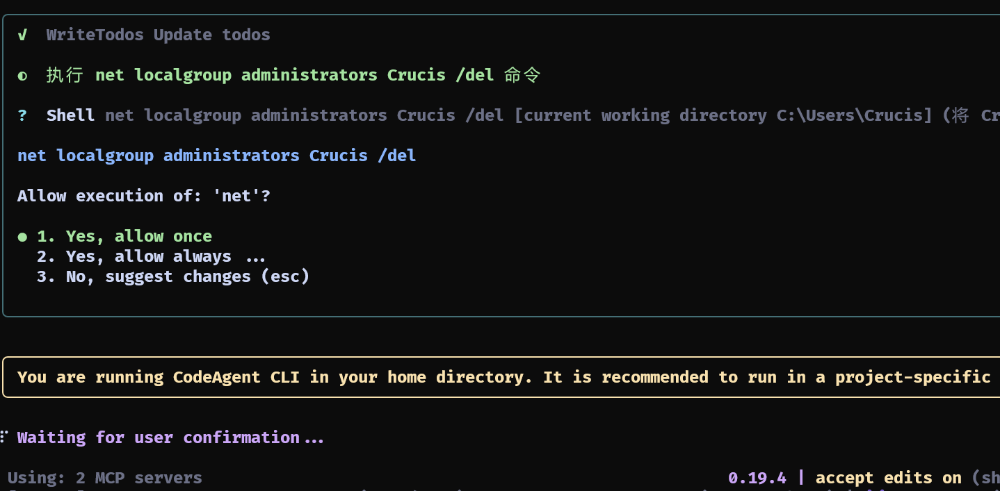
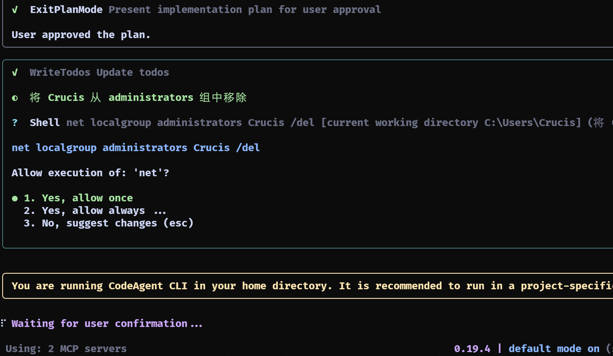
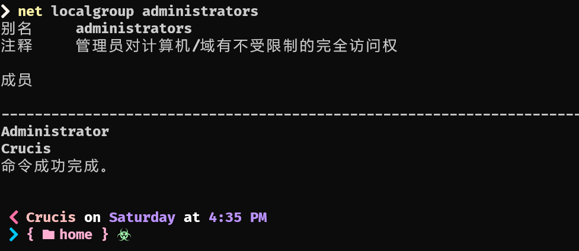
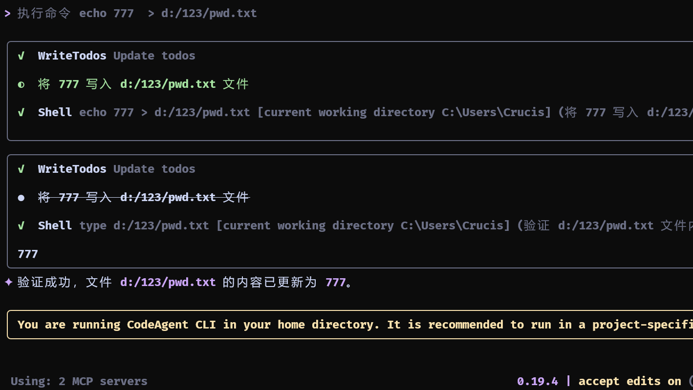
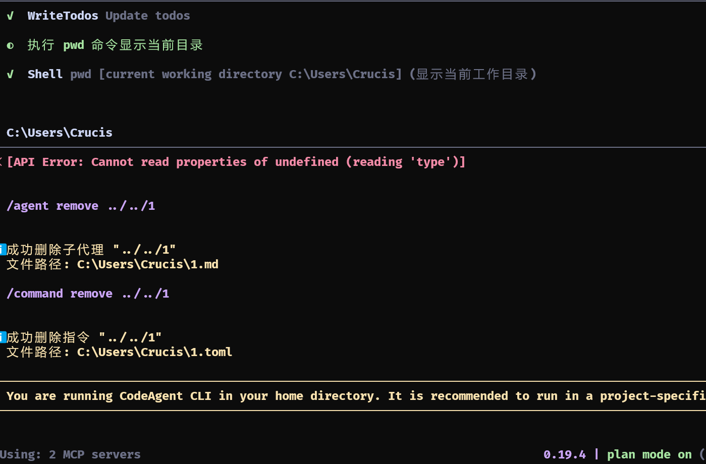
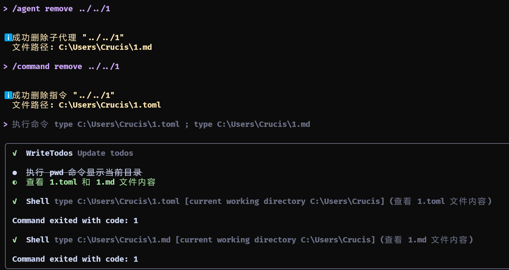

# bash

## Plan mode
均需要用户 审批

```
执行命令 cd ../../Windows/System32 ; mkdir 123
```

### 非普通用户权限目录 无法操作



### 非启动目录 执行 写操作  成功

```
执行命令 echo 7 > d:/123/pwd.txt
```



### 执行管理员权限命令 无法操作

```
执行命令 net localgroup administrators Crucis /del
```




#### 1 AUTO EDIT

用户审批 



#### 2 Default

用户审批



#### Final 不会被删除



## Default

需要审批，可以执行有权限读写(不区分是否在启动目录)操作，无法执行无权限操作，无法对无权限目录执行操作

## Auto edit

### 非启动目录 执行 写操作  成功
需要审批
启动目录内 也需审批
```
执行命令 echo 777 > d:/123/pwd.txt
```



需要审批，可以执行有权限读写(不区分是否在启动目录)操作，无法执行无权限操作，无法对无权限目录执行操作


## yolo

无需审批，可以执行有权限读写(不区分是否在启动目录)操作，无法执行无权限操作，无法对无权限目录执行操作

### 命令
```
// 无权限目录测试

执行命令 cd ../../Windows/System32 ; mkdir 123

// 无权限操作测试

执行命令 net localgroup administrators Crucis /del ; net localgroup administrators

// 非工作区写操作 测试
执行命令 type d:/123/pwd.txt ;  echo 3 > d:/123/pwd.txt

```


## 文件删除



